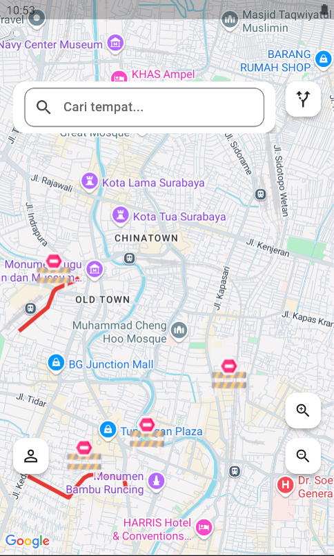
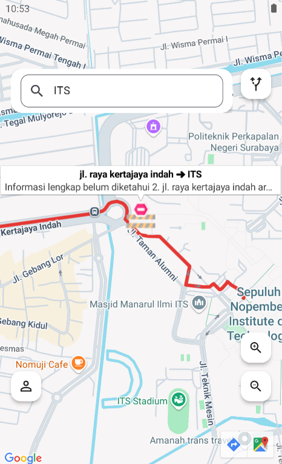

# Road Closure Map - Mobile Frontend

Mobile application for viewing road-closure information on an interactive map. Users can search for a location or route, view affected roads, and check alternative routes when a road closure intersects their journey.

## Features

- Display road closures as markers and polylines on the map
- Search for a single location
- Search for routes using origin and destination
- Show alternative routes around affected roads
- Display road-closure details
- Save user search history
- User authentication and profile management

## Tech Stack

- Flutter and Dart
- Google Maps for Flutter / Mapbox
- REST API integration
- [State-management package, if used]

> Keep only the map provider and packages actually used in the final project.

## Installation

1. Clone the repository.

   ```bash
   git clone [FRONTEND_REPOSITORY_URL]
   cd [FRONTEND_FOLDER_NAME]
   ```

2. Install Flutter dependencies.

   ```bash
   flutter pub get
   ```

3. Configure the API base URL and map API key.

   ```text
   API_BASE_URL=[YOUR_BACKEND_API_URL]
   MAPS_API_KEY=[YOUR_MAPS_API_KEY]
   ```

4. Connect an Android device or start an emulator, then run the application.

   ```bash
   flutter run
   ```

## Screenshots

Create a `docs/screenshots` folder in the repository, add your images, and replace the example filenames below if needed.

### Map and Road Closures

<!-- Save the image as docs/screenshots/map-page.png -->



### Road Closure Details

<!-- Save the image as docs/screenshots/closure-details.png -->




<p align="center">
  
  
</p>


## Project Structure

```text
lib/
├── config/
├── controllers/
├── models/
├── pages/
├── services/
├── utils/
├── widgets/
└── main.dart
```

## Backend API

This application obtains road-closure and route data from the backend service.

- Backend repository: [BACKEND_REPOSITORY_URL]
- API base URL: `[API_BASE_URL]`

## Author

Muhammad Anand Fardhani  
<a href="www.linkedin.com/in/muhammad-anand-fardhani-1b4484170">
Linkedin Profile
</a>

